  <picture><source media="(prefers-color-scheme: light)" srcset="assets/header-light.svg"></picture>

  <a href="https://janhaviwararkar.github.io"><picture><source media="(prefers-color-scheme: light)" srcset="assets/btn-portfolio-light.svg"></picture></a>
  <a href="https://www.linkedin.com/in/janhavimanojwararkar/"><picture><source media="(prefers-color-scheme: light)" srcset="assets/btn-linkedin-light.svg"></picture></a>
  <a href="mailto:janhaviwararkar10@gmail.com"><picture><source media="(prefers-color-scheme: light)" srcset="assets/btn-email-light.svg"></picture></a>

### `> whoami`

I'm a Junior Embedded Engineer at **DAO EVTech**, writing embedded software and firmware for electric two-wheelers. My B.Tech is in Electronics & Telecommunication from **PCCOE**, with Honors in Semiconductor Technology.

Most of my days go into range estimation, CAN bus diagnostics, BMS telemetry and finding out why hardware fails in the field. I also mentor the interns on our IoT team. Off the clock I'm usually reading classics or a mystery thriller.

### `> ./lab --live`

  <picture><source media="(prefers-color-scheme: light)" srcset="assets/lab-light.svg"></picture>

### `> cat pinout.txt`

  <picture><source media="(prefers-color-scheme: light)" srcset="assets/pinout-light.svg"></picture>

### `> ls work/`

| Work | What it does | Stack |
|---|---|---|
| [**Distance-to-Empty algorithm**](https://janhaviwararkar.github.io/#work) | Range estimate for electric scooters that blends riding history with live throttle power, at about ±8% average error | Python, Flask, WebSocket, SQLite |
| [**Hall sensor failure analysis**](https://janhaviwararkar.github.io/#work) | Instrumented a running hub motor and found the failures trace back to condensation right after the motor stops | ESP32, ESP-IDF, FreeRTOS, I2C, InfluxDB |
| [**RS-485 BMS monitoring tool**](https://janhaviwararkar.github.io/#work) | Desktop tool that reads live battery data with CRC-16-Modbus checks, and flagged firmware bugs in a new BMS | Python, PyQt5, PySerial |
| [**CAN bus reverse engineering**](https://janhaviwararkar.github.io/#work) | Tapped the VCU, MCU and BMS on a production scooter to map and stress-test its network | CAN, CANTest, USBCAN-2E |

### `> ls projects/undergrad/`

| Project | What it does | Stack |
|---|---|---|
| **Smart Transportation Hub** | ESP32 vehicle tracking with crash alerts and multi-load-cell weighing for overload and imbalance | ESP32, HX711, GPS, GSM |
| **Health Monitoring over LoRaWAN** | Low-power wearable sending vitals and location over long range, for elderly care and soldiers | LoRaWAN, Embedded C, sensors |
| **Voice-Based Smart Notice Board** | Raspberry Pi notice board controlled by voice and a companion app | Raspberry Pi, Python, LCD |

### `> top`

- Refining the Distance-to-Empty algorithm on production scooters
- CAN and RS-485 diagnostics tooling for the EV telematics platform
- Putting my project code up here, one repo at a time

### `> dmesg | tail`

  <picture><source media="(prefers-color-scheme: light)" srcset="https://raw.githubusercontent.com/janhaviwararkar/janhaviwararkar/output/dashboard-light.svg"></picture>

  <picture><source media="(prefers-color-scheme: light)" srcset="https://raw.githubusercontent.com/janhaviwararkar/janhaviwararkar/output/ride-light.svg"></picture>

